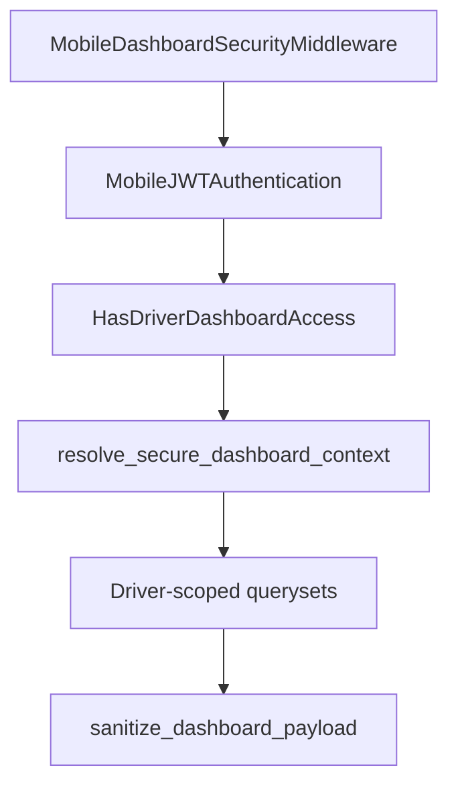

# Driver Home Dashboard — Security & RBAC

## Threat model

| Risk | Mitigation |
|------|------------|
| Cross-tenant data leak | JWT `tenant_schema` + `schema_context`; tenant hint must match token |
| Cross-driver visibility | All queries filter by resolved `DriverMaster` PK; JWT `driver_id` bound to DB row |
| Dispatcher/admin reading driver dashboard | `HasDriverDashboardAccess` requires **driver** role group + `driver_id` claim |
| Stolen token, wrong `X-Tenant-ID` | Middleware + `validate_dashboard_tenant_binding` → 403 |
| IDOR via embedded shipment/movement IDs | Ownership checks + outbound sanitization |

## Authorization layers



### 1. Middleware (`MobileDashboardSecurityMiddleware`)

- Paths: `/api/v1/mobile/driver/dashboard/*`
- **GET/HEAD/OPTIONS only** (read-only dashboard)
- If `Authorization` + `X-Tenant-ID`: JWT `tenant_schema` must equal registry schema for hint

### 2. DRF permissions (`HasDriverDashboardAccess`)

Replaces manual `IsMobileAuthenticated` + `IsDriver` + `HasViewMobileCapability` on dashboard views.

Requires:

- Valid mobile JWT session
- Driver principal (`driver_id` + allowed `role_name`)
- Capability **`mobile.driver.dashboard`**
- Tenant hint (if any) consistent with JWT `tenant_schema`

### 3. Service gate (`resolve_secure_dashboard_context`)

Called by dashboard, activity, and notifications services:

- Loads `TenantUser` + `DriverMaster` in token tenant schema
- Rejects `tenant_schema` argument ≠ JWT `tenant_schema`
- Rejects JWT `driver_id` ≠ DB `driver.driver_id` (when claim present)
- Returns `SecureDashboardContext`

### 4. Query filtering (driver filtering strategy)

| Resource | Filter |
|----------|--------|
| Shipments | `driver_shipment_scope_q` — row `driver_id` OR `booking.assigned_driver_id` |
| Movements | `driver_movement_scope_q` — `driver_id` |
| Action logs | `driver_id = driver.pk` |
| Inbox | `driver = driver` FK |
| Push receipts | `reference_id = driver_id`, `tenant_id = tenant_profile` |

Helpers in `mobile_api/helpers/dashboard_security.py`:

- `shipment_queryset_for_driver(driver)`
- `movement_queryset_for_driver(driver)`
- `action_log_queryset_for_driver(driver)`
- `inbox_queryset_for_driver(driver)`

### 5. Ownership validation

| Check | Function |
|-------|----------|
| Shipment ID | `driver_owns_shipment_id(driver, shipment_id)` |
| Movement ID | `driver_owns_movement_id(driver, movement_id)` |
| ORM row | `assert_shipment_row_owned` / `assert_movement_row_owned` |

Used in **current job** (drop job if row fails ownership) and **quick actions** (omit IDs when not owned).

### 6. Quick-action authorization

Each action in `QUICK_ACTION_REGISTRY` lists `required_capabilities` (e.g. `mobile.driver.quick_action.upload_pod`).

- Hidden when capability missing (`visible: false` — row omitted)
- `enabled` from business rules (counters / current job)
- `shipment_id` / `movement_id` only attached when `driver_owns_*` passes

### 7. Response sanitization

When `MOBILE_API_DASHBOARD_ENFORCE_OWNERSHIP_SANITIZE=True` (default):

- `sanitize_activity_items` / `sanitize_notification_items`
- `sanitize_quick_actions` / `sanitize_dashboard_payload` on full dashboard

Defense-in-depth if a queryset regression slips through.

## Capability matrix

| Capability | Role group | Endpoints |
|------------|------------|-----------|
| `mobile.driver.dashboard` | `driver` | All `/driver/dashboard/*` |
| `mobile.driver.quick_action.*` | `driver` | Quick action visibility in payload |

Register overrides via `register_mobile_capability()` in `AppConfig.ready`.

## Settings

| Variable | Default | Purpose |
|----------|---------|---------|
| `MOBILE_API_DASHBOARD_ENFORCE_OWNERSHIP_SANITIZE` | `true` | Strip foreign entity IDs from responses |
| `MOBILE_API_DASHBOARD_MIDDLEWARE_ENFORCE_TENANT` | `true` | JWT vs `X-Tenant-ID` on dashboard paths |
| `MOBILE_API_JWT_STRICT_CLAIM_BINDING` | `true` | Global JWT `driver_id` / email binding |

## Client contract

- Send **`Authorization: Bearer <access_token>`** (required).
- **`X-Tenant-ID`** optional; if sent, must match login tenant.
- Do not call dashboard APIs with dispatcher/admin tokens (no `driver_id` → 403).

## Files

```
mobile_api/rbac.py                          # CAPABILITY_GROUPS
mobile_api/permissions.py                   # HasDriverDashboardAccess
mobile_api/middleware.py                    # MobileDashboardSecurityMiddleware
mobile_api/helpers/dashboard_security.py    # Scope + ownership + sanitize
mobile_api/views/driver_dashboard.py        # Permission wiring
```
