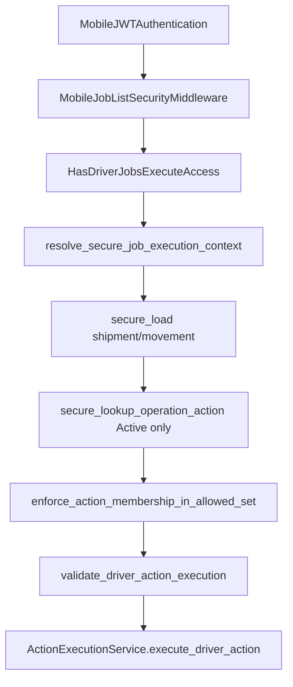

# Driver job execution security

Multi-tenant security for **mutation** routes under `/api/v1/mobile/driver/jobs/`:

| Route | Method | Capability |
|-------|--------|------------|
| `.../actions/execute/` | POST | `mobile.driver.jobs.execute` |
| `.../upload-pod/` | POST | `mobile.driver.jobs.execute` (+ optional `mobile.driver.quick_action.upload_pod`) |
| `.../collect-cod/` | POST | `mobile.driver.jobs.execute` (+ optional `mobile.driver.quick_action.cod_collection`) |

Read routes (detail, timeline, allowed-actions, lists) keep `mobile.driver.jobs` and `HasDriverJobsAccess`.

## Request pipeline

## Guarantees

1. **JWT** — global `IsMobileAuthenticated` + driver role group.
2. **Tenant** — JWT `tenant_schema` vs `X-Tenant-ID` binding (`validate_jobs_execution_tenant_binding`).
3. **Shipment / movement ownership** — driver-scoped querysets + `assert_*_row_owned` (IDOR-safe loads).
4. **Action authorization** — workflow engine policy + optional allowed-actions set membership (tampering guard).
5. **Secure action lookup** — only `TenantOperationAction` rows with `status=Active`.
6. **Audit protection** — `strip_execution_audit_tamper_fields`; action logs validated for `driver_id` on sensitive paths.
7. **Security audit log** — `mobile_api.security` events (`execution_*`) when `MOBILE_API_JOBS_EXECUTION_AUDIT_ENABLED=True`.

## Settings

| Setting | Default | Purpose |
|---------|---------|---------|
| `MOBILE_API_JOBS_ENFORCE_ACTION_MEMBERSHIP` | `True` | Require `action_id` in `get_allowed_driver_actions` |
| `MOBILE_API_JOBS_EXECUTION_AUDIT_ENABLED` | `True` | Structured security audit on violations |
| `MOBILE_API_JOBS_MIDDLEWARE_ENFORCE_TENANT` | `True` | Tenant hint vs JWT on jobs routes |

## Key modules

- `mobile_api/helpers/job_execution_security.py` — context, guards, audit helpers
- `mobile_api/permissions.py` — `HasDriverJobsExecuteAccess`
- `mobile_api/views/driver_job_execution_base.py` — execution view base
- `mobile_api/middleware.py` — allows POST on execution paths only
