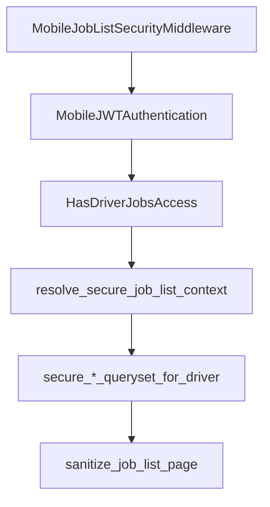

# Driver job list — security & RBAC

## Threat model

| Risk | Mitigation |
|------|------------|
| Cross-tenant data leak | JWT `tenant_schema` + `schema_context`; `X-Tenant-ID` must match token |
| Cross-driver visibility | Driver-scoped querysets; JWT `driver_id` bound to `DriverMaster` row |
| Dispatcher/admin listing driver jobs | `HasDriverJobsAccess` requires **driver** role + `driver_id` claim |
| IDOR via shipment/movement IDs in cards | Scope filters + optional outbound sanitization |
| Stolen token + wrong tenant header | `MobileJobListSecurityMiddleware` → 403 |

## Authorization layers

### 1. RBAC capability

| Capability | Role groups |
|------------|-------------|
| `mobile.driver.jobs` | `driver` only |

Defined in `mobile_api/rbac.py` → `CAPABILITY_GROUPS`.

### 2. DRF permission (`HasDriverJobsAccess`)

On all `/api/v1/mobile/driver/jobs/*` views (`_DriverJobListBaseView`):

- Valid mobile JWT session
- Driver principal (`user_in_driver_group`)
- Capability `mobile.driver.jobs`
- Tenant hint (if present) consistent with JWT `tenant_schema`

### 3. Middleware (`MobileJobListSecurityMiddleware`)

- Paths: `/api/v1/mobile/driver/jobs/*`
- **GET/HEAD/OPTIONS only**
- Bearer + `X-Tenant-ID`: JWT `tenant_schema` must equal resolved registry schema
- Audit event: `jobs_middleware_tenant_mismatch`

Setting: `MOBILE_API_JOBS_MIDDLEWARE_ENFORCE_TENANT` (default `True`).

### 4. Secure list context (`resolve_secure_job_list_context`)

Returns `SecureJobListContext`:

- Tenant user + driver row in token schema
- JWT `driver_id` must match DB driver
- Optional `ownership_scope` preload for sanitization

### 5. Secure query architecture

| Resource | Function | Filter |
|----------|----------|--------|
| Shipments | `secure_shipment_queryset_for_driver` | `driver_shipment_scope_q` |
| Movements | `secure_movement_queryset_for_driver` | `driver_movement_scope_q` |
| Action logs (batch) | `assert_job_list_action_logs_owned` | `driver_id` on fetched rows |
| Movement search subquery | `secure_shipment_queryset_for_driver` | No cross-driver shipment PKs |

Base list querysets: `job_list_query.base_*_job_queryset` → always through secure helpers.

### 6. Ownership validation

| Check | Function |
|-------|----------|
| Shipment row | `assert_driver_owns_shipment` |
| Movement row | `assert_driver_owns_movement` |
| Paginated page | `sanitize_job_list_page` (drops foreign rows, logs `job_list_ownership_violation`) |

Setting: `MOBILE_API_JOBS_ENFORCE_OWNERSHIP_SANITIZE` (default `True`).

## Settings

| Setting | Default | Purpose |
|---------|---------|---------|
| `MOBILE_API_JOBS_MIDDLEWARE_ENFORCE_TENANT` | `True` | Header vs JWT tenant binding |
| `MOBILE_API_JOBS_ENFORCE_OWNERSHIP_SANITIZE` | `True` | Outbound card sanitization |

## Module map

| File | Role |
|------|------|
| `helpers/job_list_security.py` | Context resolver, secure querysets, sanitization |
| `permissions.py` | `HasDriverJobsAccess` |
| `middleware.py` | `MobileJobListSecurityMiddleware` |
| `rbac.py` | `mobile.driver.jobs` capability |
