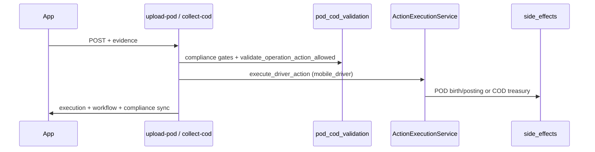

# Driver Job Detail — POD & COD APIs

Compliance-safe wrappers over the Action Log execution pipeline (A7 / A9).

## Endpoints

| Method | Path | Action Master |
|--------|------|---------------|
| `POST` | `/api/v1/mobile/driver/jobs/shipments/{shipment_id}/upload-pod/` | Upload POD (A7), `auto_pod_post` preferred |
| `POST` | `/api/v1/mobile/driver/jobs/shipments/{shipment_id}/collect-cod/` | Collect Payment (A9) |

**Capability:** `mobile.driver.jobs.execute` (or quick-action POD/COD caps — see `driver_job_execution_security.md`)  
**Content-Type:** `multipart/form-data` or `application/json`

## Execution flow

## Upload POD

**Gates**

- Driver owns shipment
- Shipment not Closed/Cancelled
- Action allowed by `get_allowed_actions()` / `validate_operation_action_allowed()`
- At least one delivery-note document on shipment
- At least one `media_file` attachment

**Side effects (existing)**

- `birth_pod_from_action_log` when `auto_pod_post`
- `apply_pod_posting_from_action_log` → DN verified, `pod_type`, `_tenant_shipment_document_refresh_shipment_pod`

**Response `compliance.pod`:** `pod_status`, `pod_type`, `needs_attention`, `document` summary

## Collect COD

**Gates**

- COD `order_type`
- `collection_status` not already Collected
- Policy engine allows A9
- `cod_amount` > 0 (body or shipment default)

**Side effects (existing)**

- `CODExecutionService.apply_collect_payment_side_effect`
- `post_cod_collection_for_action9` (idempotent treasury Client Collection debit)

**Response `compliance.cod`:** collection state + `treasury.posted`, `transaction_no`, `amount`

## Request fields (both)

| Field | Notes |
|-------|--------|
| `idempotency_key` / `source_ref` | Retry-safe |
| `notes`, `latitude`, `longitude`, `map_link` | Evidence |
| `log_date` | Optional |
| `cod_amount` | COD only |
| `media_file` | POD required (multipart) |

## Shared response blocks

- `execution` — action log result (same as `actions/execute/`)
- `workflow` — refreshed allowed actions + execution state
- `compliance` — POD or COD synchronization snapshot

## Modules

| Layer | Path |
|-------|------|
| Action resolve | `mobile_api/helpers/compliance_operation_actions.py` |
| Validation | `mobile_api/helpers/pod_cod_validation.py` |
| Service | `mobile_api/services/driver_job_pod_cod_service.py` |
| Views | `mobile_api/views/driver_job_pod_cod.py` |

Delivered transition protection remains in `PODExecutionService` / `CODExecutionService` when shipment status advances to Delivered.
